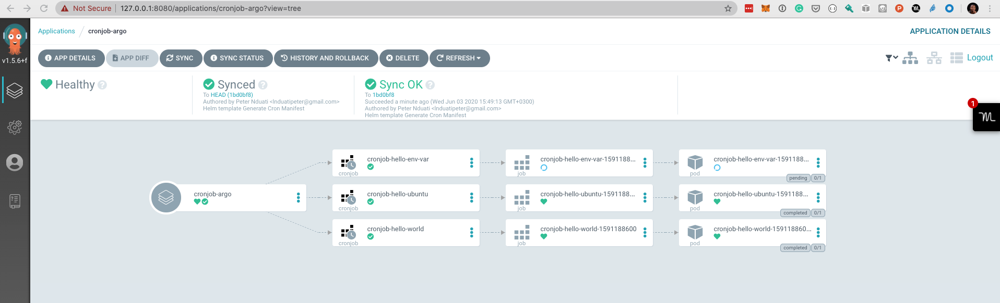

# helm-cronjobs

You can define an array of jobs in values.yaml helm will take care of creating all the CronJobs.

```
Create kubernetes kind cluster
cd kind
kind create cluster --config kind-multi-node.yaml
https://kind.sigs.k8s.io/docs/user/quick-start/
```

```
Argo CD Installation
https://argoproj.github.io/argo-cd/getting_started/#1-install-argo-cd
```

```
Deployment using Argo CD
helm template --name cronjob --namespace=crons ./helm-cronjobs --namespace=crons -f ./helm-cronjobs/values.yaml --output-dir cronjob
argocd app create cronjob-argo --repo https://github.com/pnduati/helm-cronjobs.git --path cron --dest-server https://kubernetes.default.svc --dest-namespace crons
argocd app sync cronjob-argo


```

## Examples

```

\$ helm install .
NAME: cold-fly
LAST DEPLOYED: Fri Feb 1 15:29:21 2019
NAMESPACE: default
STATUS: DEPLOYED

RESOURCES:
==> v1beta1/CronJob
NAME AGE
cold-fly-hello-world 1s
cold-fly-hello-ubuntu 1s
cold-fly-hello-env-var 1s

```

list cronjobs:

```

\$ kubectl get cronjob
NAME SCHEDULE SUSPEND ACTIVE LAST SCHEDULE AGE
cold-fly-hello-env-var \* \* \* \* _ False 0 23s 1m
cold-fly-hello-ubuntu _/5 \* \* \* _ False 0 23s 1m
cold-fly-hello-world _ \* \* \* \* False 0 23s 1m

```

list jobs:

```

\$ kubectl get jobs
NAME DESIRED SUCCESSFUL AGE
cold-fly-hello-env-var-1549056600 1 1 45s
cold-fly-hello-ubuntu-1549056600 1 1 45s
cold-fly-hello-world-1549056600 1 1 45s
```
